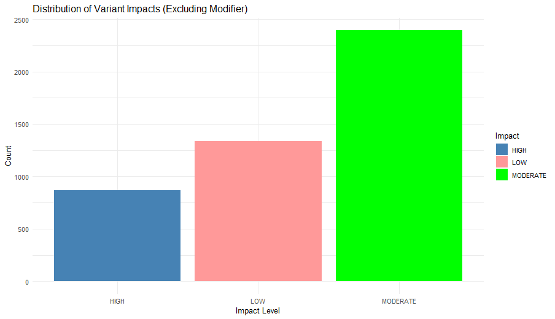
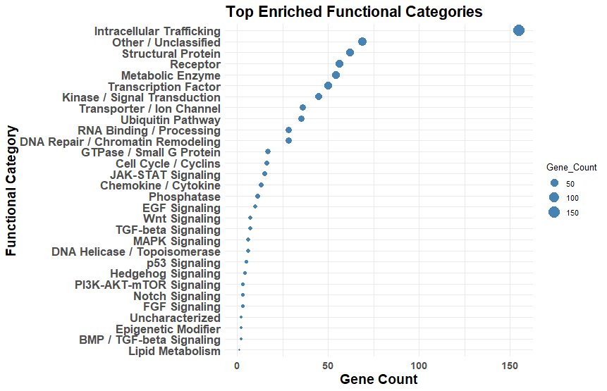
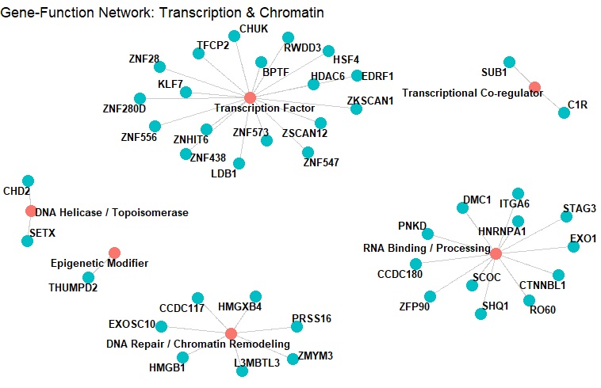

# Mutation Analysis in Clinical Genomics

## Overview
This project demonstrates analysis of mutation data to identify clinically relevant genomic alterations in cancer.

## Key Steps
- Mutation filtering
- Identification of recurrent mutations
- Functional interpretation of mutated genes
- Integration with disease context (e.g., AML)

## Tools & Packages
- R
- dplyr
- ggplot2
- maftools (optional)

## Example Output

### Mutation Impact Distribution

Distribution of genetic variants across impact categories (HIGH, MODERATE, LOW).

This provides an overview of mutation severity across the dataset.

Note: Data is anonymized for demonstration purposes.

### Functional Enrichment Analysis

Top enriched functional categories based on mutation-associated genes.

This highlights biological processes potentially affected by genomic alterations.

Note: Results are simplified for demonstration purposes.

### Gene-Function Network (Signaling Pathways)

Network representation linking mutated genes to key signaling pathways.

This illustrates potential functional relationships and pathway involvement.

Note: Visualization is simplified and anonymized.

### Gene-Function Network (Signaling Pathways)

Network representation linking mutated genes to key signaling pathways.

This illustrates potential functional relationships and pathway involvement.

Note: Visualization is simplified and anonymized.

## Clinical Relevance

This analysis highlights mutations associated with disease progression and therapeutic response.

## Author
Hager Salah Abouelnaga
